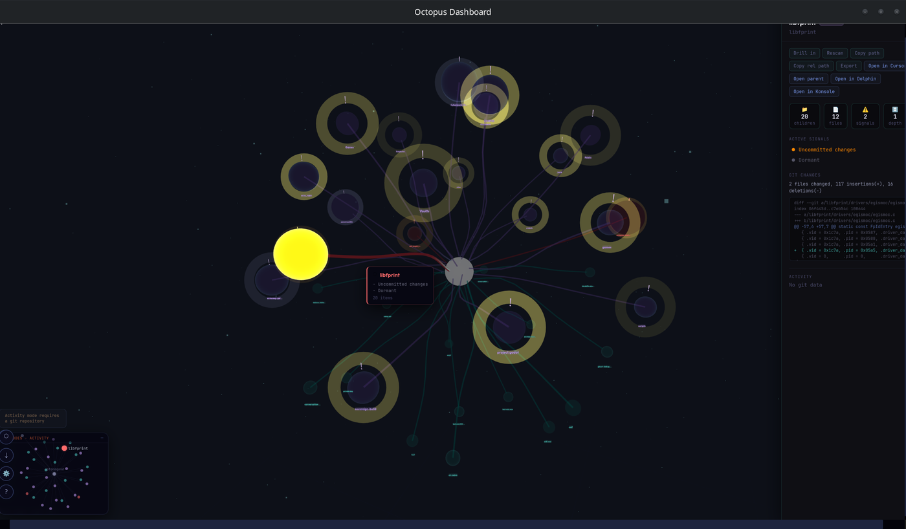
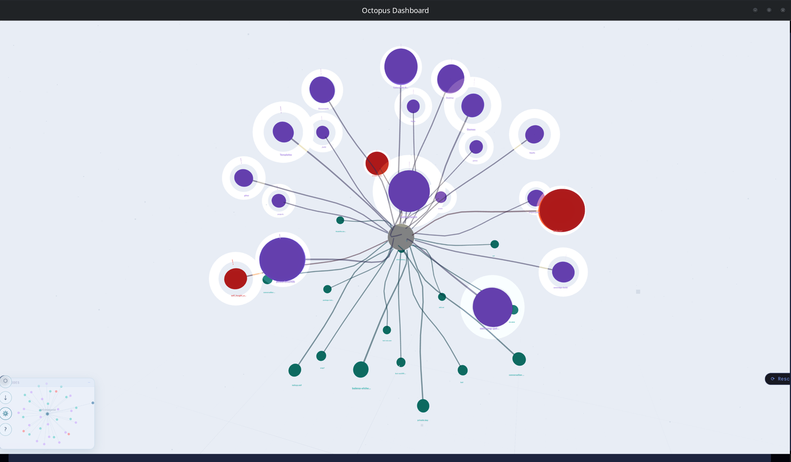
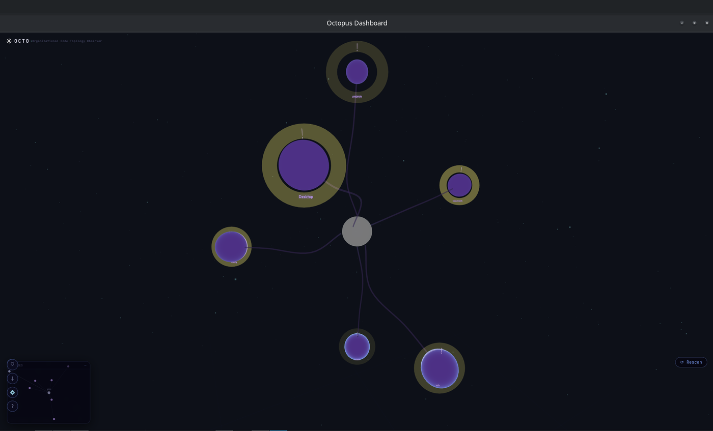
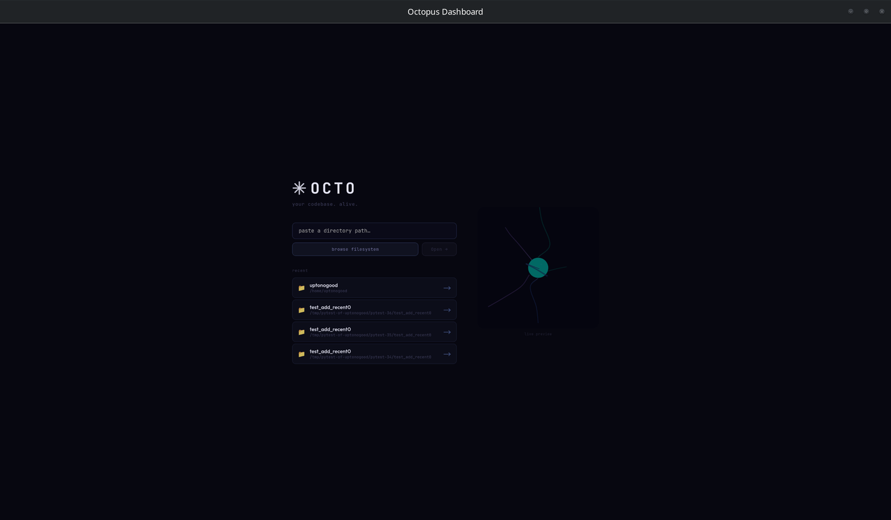

# OCTO

**A Linux desktop app that maps your project directories as an interactive 3D scene.**



---

## What it does

OCTO scans your filesystem and renders every repository and folder as a glowing node in a navigable 3D graph. Git status signals — dirty, unpushed, stale, no readme — appear as color-coded badges so you can spot what needs attention before opening a single editor. Switch between three visualization lenses: the default filesystem view, an activity heatmap driven by git commit history, and an architecture map that color-clusters your code by semantic category.

---

## Key workflows

- **Triage your repos at a glance** — dirty and unpushed nodes glow coral; clean repos stay violet or teal. No more forgetting what you were working on.
- **Find what changed recently** — Activity mode overlays a commit heatmap. Hot nodes pulse; cold ones fade. See in seconds which projects are active and which have gone quiet.
- **Understand a project's shape** — Architecture mode clusters nodes by category (backend, frontend, tests, config, docs…) with distinct colors, giving you a structural overview without reading any code.
- **Jump straight to work** — Select any node and open it in your editor, terminal, or file manager with one click. Preview file contents and git diffs without leaving the app.
- **Keep favorites handy** — Pin frequently visited folders to the tray; fuzzy-search everything with `Ctrl+K`.

---

## Screenshots

<table>
<tr>
<td align="center" width="50%">
<br>
<sub><b>Light theme</b> — the full radial graph across all your projects. Red nodes are git-dirty or unpushed; violet nodes are clean.</sub>
</td>
<td align="center" width="50%">
<br>
<sub><b>Dark theme</b> — default view with star-field background, animated tentacle lines, and the minimap in the corner.</sub>
</td>
</tr>
</table>


*First launch — paste a path or browse to pick the root directory you want to visualize.*

---

## Install

The latest release is **[v1.1.1](https://github.com/csmcoding/OCTO/releases/tag/v1.1.1)** — download the package for your distro from the release page. No Python or other runtime required.

**Ubuntu / Debian**
```bash
sudo dpkg -i octopus-dashboard_1.1.1_amd64.deb
octo
```

**Fedora / RHEL**
```bash
sudo rpm -i octopus-dashboard-1.1.1-1.x86_64.rpm
octo
```

The app opens as a native desktop window. It starts its own backend on launch and shuts it down on close.

---

## Configuration

Settings are created on first run at `~/.config/octopus-dashboard/settings.json`. Edit `scan_roots` to point at the directories you want scanned.

```json
{
  "scan_roots": ["/home/you/projects"],
  "editor": "code",
  "terminal": "bash",
  "file_manager": "xdg-open"
}
```

Press `R` inside the app to rescan after changing roots.

---

## Keyboard shortcuts

| Key | Action |
|-----|--------|
| `T` | Toggle Activity mode |
| `A` | Toggle Architecture mode |
| `Ctrl+K` | Fuzzy search |
| `S` | Settings |
| `R` | Rescan filesystem |
| `O` | Change root directory |
| `Scroll` | Zoom in / out |
| `Backspace` | Go up one level |
| `Esc` | Deselect / close panel |

---

## Run from source

```bash
git clone https://github.com/csmcoding/OCTO.git
cd OCTO
bash install.sh      # checks prerequisites, installs Python + Node deps
./start.sh           # dev mode (Vite dev server + backend)
./start.sh --prod    # production mode (built frontend + backend)
```

---

## Building the desktop package from source

```bash
# Linux system deps (one-time)
sudo apt-get install -y libwebkit2gtk-4.1-dev libgtk-3-dev librsvg2-dev libayatana-appindicator3-dev

# Rust toolchain (one-time)
curl --proto '=https' --tlsv1.2 -sSf https://sh.rustup.rs | sh

cd frontend
npm install
npm run tauri:build
# Packages: src-tauri/target/release/bundle/deb/  and  bundle/rpm/
```

The build script compiles the Python backend into a self-contained sidecar binary using PyInstaller — no Python installation required on the target machine.

---

## Known limitations

- **Linux only.** No Windows or macOS packages are currently built.
- **AppImage not included.** Excluded due to a linuxdeploy incompatibility on some hosts; `.deb` and `.rpm` are the supported formats.

---

## License

MIT — see [LICENSE](LICENSE).
